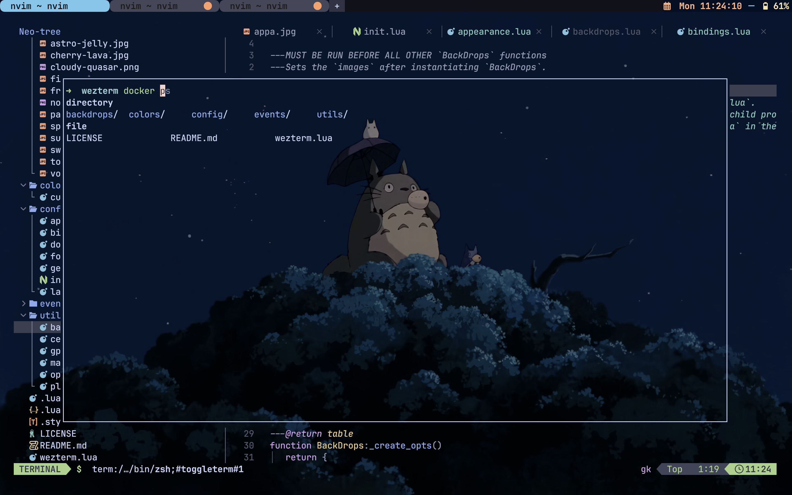

# vim_conf

A modern development environment configuration repository focused on Wezterm terminal and Neovim setup with LazyVim as the configuration framework.

## Overview
This repository contains my personal development environment configuration with:
- **Wezterm**: A modern terminal emulator with extensive customization
- **Neovim**: Hyperextensible text editor configured with LazyVim
- **LazyVim**: A pre-configured Neovim setup built on lazy.nvim for easy customization

## Features

### Wezterm Configuration
- Custom key bindings and shortcuts
- Color schemes and visual customization
- Tab and pane management
- Font and rendering optimizations

### Neovim + LazyVim Setup
- Modern IDE-like features
- Extensible plugin architecture
- LSP (Language Server Protocol) integration
- Treesitter for syntax highlighting and parsing
- Telescope for fuzzy finding
- Git integration with lazygit

## Demo

## Installation

1. Clone this repository
2. Copy the configuration files to your respective config directories
3. Install required plugins and dependencies

## Structure

- `wezterm/` - Wezterm terminal configuration
- `nvim/` - Neovim configuration with LazyVim
- `images/` - Demo screenshots and visual documentation
